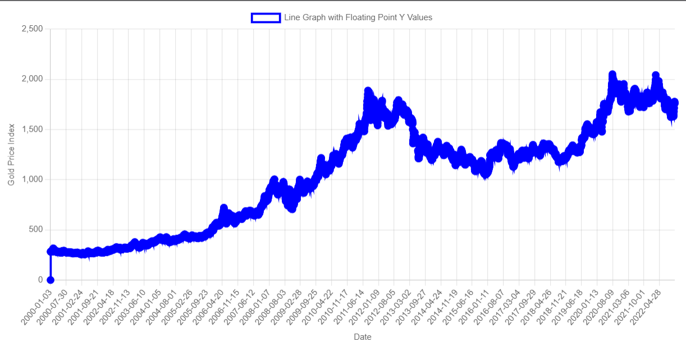

# Gold_Commidity_Kaggle

Using  the dataset that is availible in this link from Kaggle I was able to create a Time Series plot of the Gold column using HTML, CSS, JavaScript, PHP, and MySQL.

https://www.kaggle.com/datasets/debashish311601/commodity-prices?resource=download

